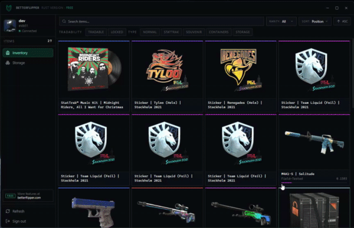

# BetterFlipper CS2 Inventory Manager

A small, native CS2 inventory & storage-unit manager.



## What it does

- Sign in to your Steam account (Steam Guard / TOTP / saved refresh token)
- Browse your CS2 inventory names, images, stickers, float, wear, patterns
- Open storage units, move items in / out with drag-to-select, rename them


## Stack

| | |
|--|--|
| Shell | [Tauri 2](https://tauri.app) |
| Frontend | [Svelte 5](https://svelte.dev) + Tailwind |
| Steam | [`steam-vent`](https://crates.io/crates/steam-vent) (pure-Rust CM client) |
| Game Coordinator | [`steam-vent-proto-csgo`](https://crates.io/crates/steam-vent-proto-csgo) |
| Item metadata | [`ByMykel/CSGO-API`](https://github.com/ByMykel/CSGO-API) |
| Token storage | OS keychain via [`keyring`](https://crates.io/crates/keyring) |

## Install

Grab the latest installer from [Releases](../../releases) and run it.
Windows only for now Linux build works but isn't packaged yet, see below.

## Build from source

```bash
git clone <this repo>
cd cs2-inventory-manager
npm install
npm run tauri build
```

## License

MIT. Do whatever, just don't sue me.
